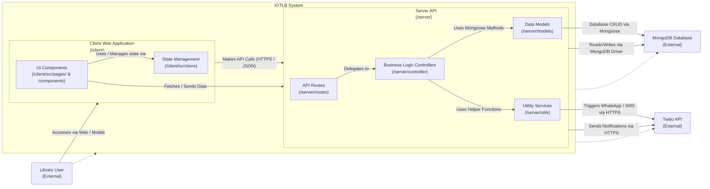

```mermaid
graph LR
    %% External Entities
    user["Library User<br/>(External)"]
    database["MongoDB Database<br/>(External)"]
    twilio["Twilio API<br/>(External)"]

    %% Main System
    subgraph iotlbSystem["IOTLB System"]
        
        %% Client Side
        subgraph clientApp["Client Web Application<br/>(/client)"]
            uiComponents["UI Components<br/>(/client/src/pages/ & /components)"]
            stateManagement["State Management<br/>(/client/src/store)"]
            uiComponents -->|"Uses / Manages state via"| stateManagement
        end

        %% Server Side
        subgraph serverApi["Server API<br/>(/server)"]
            apiRoutes["API Routes<br/>(/server/routes)"]
            controllers["Business Logic Controllers<br/>(/server/controller)"]
            dataModels["Data Models<br/>(/server/models)"]
            utilityServices["Utility Services<br/>(/server/utils)"]

            apiRoutes -->|"Delegates to"| controllers
            controllers -->|"Uses Mongoose Methods"| dataModels
            controllers -->|"Uses Helper Functions"| utilityServices
        end

        %% Client ↔ Server
        clientApp -->|"Makes API Calls (HTTPS / JSON)"| serverApi
        uiComponents -->|"Fetches / Sends Data"| serverApi
    end

    %% External Interactions
    user -->|"Accesses via Web / Mobile"| clientApp
    serverApi -->|"Reads/Writes via MongoDB Driver"| database
    serverApi -->|"Sends Notifications via HTTPS"| twilio
    dataModels -->|"Database CRUD via Mongoose"| database
    utilityServices -->|"Triggers WhatsApp / SMS via HTTPS"| twilio

    %% Layout helpers (invisible arrows for better spacing)
    user -.-> iotlbSystem
    iotlbSystem -.-> database
    iotlbSystem -.-> twilio

```

