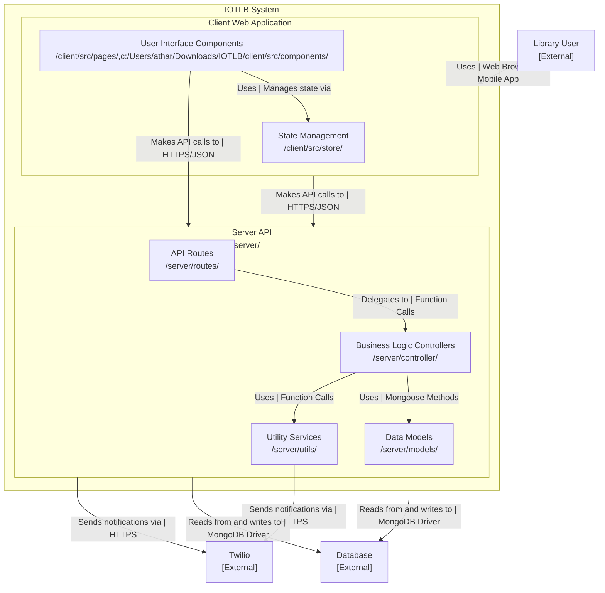

# Unnamed CodeViz Diagram

```mermaid
graph TD

    user["Library User<br>[External]"]
    database["Database<br>[External]"]
    twilio["Twilio<br>[External]"]
    subgraph iotlbSystem["IOTLB System<br>/"]
        subgraph clientApp["Client Web Application<br>/client/"]
            uiComponents["User Interface Components<br>/client/src/pages/,c:/Users/athar/Downloads/IOTLB/client/src/components/"]
            stateManagement["State Management<br>/client/src/store/"]
            %% Edges at this level (grouped by source)
            uiComponents["User Interface Components<br>/client/src/pages/,c:/Users/athar/Downloads/IOTLB/client/src/components/"] -->|"Uses | Manages state via"| stateManagement["State Management<br>/client/src/store/"]
        end
        subgraph serverApi["Server API<br>/server/"]
            apiRoutes["API Routes<br>/server/routes/"]
            controllers["Business Logic Controllers<br>/server/controller/"]
            dataModels["Data Models<br>/server/models/"]
            utilityServices["Utility Services<br>/server/utils/"]
            %% Edges at this level (grouped by source)
            apiRoutes["API Routes<br>/server/routes/"] -->|"Delegates to | Function Calls"| controllers["Business Logic Controllers<br>/server/controller/"]
            controllers["Business Logic Controllers<br>/server/controller/"] -->|"Uses | Mongoose Methods"| dataModels["Data Models<br>/server/models/"]
            controllers["Business Logic Controllers<br>/server/controller/"] -->|"Uses | Function Calls"| utilityServices["Utility Services<br>/server/utils/"]
        end
        %% Edges at this level (grouped by source)
        clientApp["Client Web Application<br>/client/"] -->|"Makes API calls to | HTTPS/JSON"| serverApi["Server API<br>/server/"]
        uiComponents["User Interface Components<br>/client/src/pages/,c:/Users/athar/Downloads/IOTLB/client/src/components/"] -->|"Makes API calls to | HTTPS/JSON"| serverApi["Server API<br>/server/"]
    end
    %% Edges at this level (grouped by source)
    user["Library User<br>[External]"] -->|"Uses | Web Browser / Mobile App"| clientApp["Client Web Application<br>/client/"]
    serverApi["Server API<br>/server/"] -->|"Reads from and writes to | MongoDB Driver"| database["Database<br>[External]"]
    serverApi["Server API<br>/server/"] -->|"Sends notifications via | HTTPS"| twilio["Twilio<br>[External]"]
    dataModels["Data Models<br>/server/models/"] -->|"Reads from and writes to | MongoDB Driver"| database["Database<br>[External]"]
    utilityServices["Utility Services<br>/server/utils/"] -->|"Sends notifications via | HTTPS"| twilio["Twilio<br>[External]"]

```
---
*Generated by [CodeViz.ai](https://codeviz.ai) on 10/28/2025, 1:11:43 PM*
