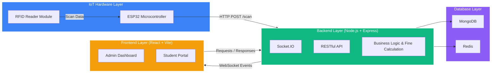
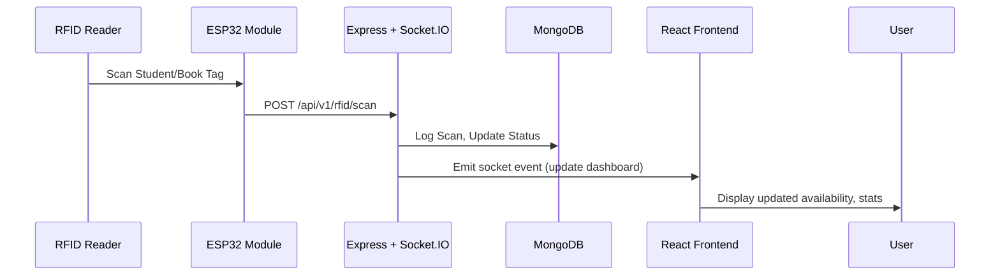

# IOTLB — IoT-Enabled Library Management System

IOTLB is a **real-time, RFID-powered library automation platform** that seamlessly bridges physical book management with digital infrastructure.
It integrates **IoT hardware (RFID + ESP32)** with a **Node.js + MongoDB backend** and a **React-based dashboard** to deliver smart, automated, and contactless library operations.


## Overview

Traditional library systems are manual, time-consuming, and prone to errors.
IOTLB revolutionizes this with an **IoT + Web-based hybrid model**:

* Contactless RFID scans for both students and books
* Real-time synchronization via Socket.IO
* Automated issue/return and fine management
* Role-based dashboards for administrators and students
* Redis-backed scalability for live statistics and session handling


## Architecture

IOTLB uses a **distributed, event-driven architecture** that connects IoT hardware to cloud services in real time.
Each RFID scan triggers a data flow from device → server → database → frontend dashboard.




## Tech Stack

| Layer               | Technology                                                                                                                     | Purpose                                          |
| ------------------- | ------------------------------------------------------------------------------------------------------------------------------ | ------------------------------------------------ |
| **Frontend**        |  **React** +  **Vite**               | Interactive and modular web client               |
|                     |  **Tailwind CSS**                                                          | Responsive and fast UI design                    |
|                     |  **Socket.IO Client**                                                     | Real-time updates and sync                       |
| **Backend**         |  **Node.js** +  **Express** | REST APIs and WebSocket gateway                  |
|                     | **Socket.IO (Server)**                                                                                                         | Real-time data push and RFID session sync        |
|                     | **Redis**                                                                                                                      | Socket scaling, caching, and sessions            |
|                     |  **MongoDB**                                                                 | Data persistence (books, students, transactions) |
| **IoT Layer**       |  **ESP32 + RFID RC522**                                                      | Physical book/student identification             |
| **Notifications**   | **Twilio API**                                                                                                                 | SMS alerts for fines, issue/return updates       |
| **DevOps**          |  **Docker**                                                                    | Containerized services for Redis, MongoDB        |
| **Package Manager** |  **pnpm**                                                                          | Fast and isolated dependency management          |


## Key Features

| Category              | Description                                                |
| --------------------- | ---------------------------------------------------------- |
| **RFID Integration**  | Contactless student and book recognition via RFID scanning |
| **Live Statistics**   | Real-time library occupancy, usage, and section tracking   |
| **Automated Fines**   | Dynamic calculation based on overdue periods               |
| **Digital Shelf**     | Online book browsing and request system                    |
| **Twilio SMS Alerts** | Issue/return notifications to registered students          |
| **Admin Dashboard**   | Manage users, books, and borrow history                    |
| **Student Portal**    | View borrowed books, dues, and request new titles          |
| **Socket.IO Sync**    | Instant updates for book availability and active users     |


## API Design

### Book Routes (`/api/v1/books`)

| Method | Endpoint | Description                  |
| ------ | -------- | ---------------------------- |
| GET    | `/`      | Get all books                |
| GET    | `/:id`   | Get details of a single book |
| POST   | `/`      | Add a new book record        |
| PUT    | `/:id`   | Update book information      |
| DELETE | `/:id`   | Remove a book from inventory |

### Student Routes (`/api/v1/students`)

| Method | Endpoint    | Description                          |
| ------ | ----------- | ------------------------------------ |
| POST   | `/register` | Register a new student               |
| POST   | `/login`    | Authenticate student                 |
| GET    | `/profile`  | Fetch profile details *(protected)*  |
| PUT    | `/profile`  | Update student details *(protected)* |

### RFID Routes (`/api/v1/rfid`)

| Method | Endpoint       | Description                   |
| ------ | -------------- | ----------------------------- |
| POST   | `/scan`        | Log a scan event (from ESP32) |
| GET    | `/section/:id` | Fetch live section activity   |


## Environment Variables

Create `.env` in `/server`:

```bash
NODE_ENV=development
SERVER_PORT=5000

# MongoDB
MONGODB_URI=mongodb+srv://<username>:<password>@cluster.mongodb.net/iotlb

# Redis
REDIS_URL=redis://localhost:6379

# Twilio (Optional)
TWILIO_ACCOUNT_SID=ACXXXXXXXXXXXXXXXXXXXXXXXXXXXX
TWILIO_AUTH_TOKEN=your_auth_token
TWILIO_FROM=+14155238886
```

For `/client/.env`:

```bash
VITE_API_URL=http://localhost:5000/api/v1
VITE_SOCKET_URL=http://localhost:5000
```


## Installation

```bash
# Clone repository
git clone https://github.com/Atharvkote/IOTLB.git
cd IOTLB
```

### Client Setup

```bash
cd client
pnpm install
pnpm run dev
```

### Server Setup

```bash
cd ../server
pnpm install
pnpm run dev
```

Access:

* Frontend: [http://localhost:5173](http://localhost:5173)
* Backend: [http://localhost:5000](http://localhost:5000)


## Real-Time Flow




## Scaling & Performance

| Strategy                        | Description                                               |
| ------------------------------- | --------------------------------------------------------- |
| **Redis Adapter for Socket.IO** | Enables cross-instance communication between Node servers |
| **Load Balancing (Nginx)**      | Distributes HTTP and WebSocket traffic                    |
| **MongoDB Indexing**            | Optimizes frequent queries like student/book lookups      |
| **Rate Limiting (Redis)**       | Protects endpoints from overuse                           |
| **Twilio Async Workers**        | Offloads SMS sending to background tasks                  |


## Roadmap

* [ ] Mobile app for students
* [ ] Role-based access for staff
* [ ] QR support alongside RFID
* [ ] Enhanced analytics and reports
* [ ] Payment integration for fines
* [ ] Offline mode for ESP32 scanning


## Contribution Guide

1. Fork this repository
2. Create a feature branch
3. Commit your changes with clear messages
4. Push and create a Pull Request


## License

This project is licensed under the **MIT License**.
© 2025 [Atharva Kote](https://github.com/Atharvkote)


